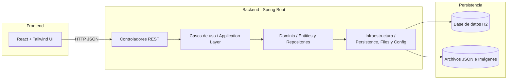
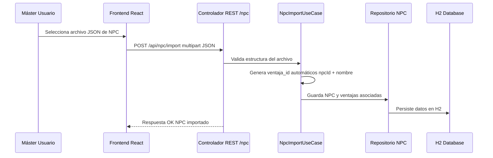
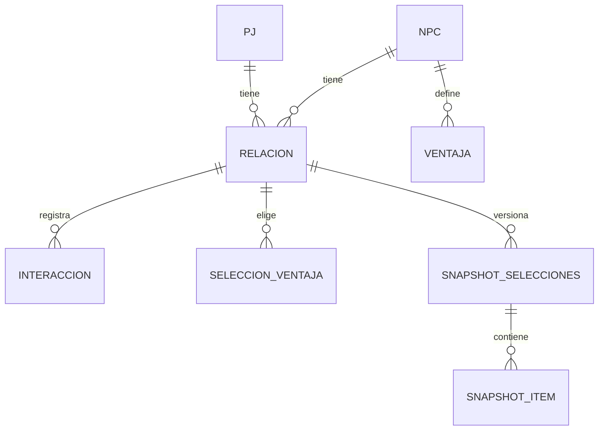

# Documento de Arquitectura Técnica (SAD)
### Sistema de Relaciones — Campaña *El Regente de Jade*
**Versión:** 1.0  
**Autor:** Alberto Cebrián  
**Fecha:** Octubre de 2025  

---

## 1. Propósito y alcance del documento

El presente documento describe la **arquitectura técnica** del Sistema de Relaciones desarrollado para la campaña *El Regente de Jade*. Su propósito es detallar cómo se organiza internamente la aplicación, qué componentes la integran, cómo se comunican entre sí y qué principios de diseño se han aplicado para garantizar la mantenibilidad y escalabilidad del sistema.

Este documento sirve como guía técnica para el desarrollo, ampliación y mantenimiento de la aplicación.

---

## 2. Visión general de la arquitectura

### 2.1 Introducción a la arquitectura hexagonal

La arquitectura **hexagonal** (también conocida como *Ports & Adapters*) es un patrón de diseño de software que separa claramente el **núcleo del dominio** de las **interfaces externas** que interactúan con él, como bases de datos, interfaces web o APIs.  

Su objetivo principal es **aislar la lógica de negocio** de las dependencias externas, de modo que los cambios en estas (por ejemplo, sustituir una base de datos o una librería de frontend) no afecten a las reglas fundamentales del sistema.

### Ventajas principales:
- **Independencia del dominio:** la lógica central no depende de tecnologías concretas.  
- **Facilidad de pruebas:** se pueden probar los casos de uso sin necesidad de entorno externo.  
- **Mantenibilidad:** cada capa puede evolucionar sin romper las demás.  
- **Flexibilidad:** permite sustituir adaptadores fácilmente (por ejemplo, cambiar de H2 a PostgreSQL o exponer una API GraphQL).  

En el contexto del *Sistema de Relaciones — El Regente de Jade*, la arquitectura hexagonal permite:
- Mantener las reglas del sistema (niveles de relación, ventajas, interacciones) completamente aisladas del framework.  
- Facilitar futuras ampliaciones (autenticación, multijuego, nuevas interfaces).  
- Evitar el acoplamiento entre la persistencia, la interfaz web y la lógica de negocio.

---

### 2.2 Estructura general del sistema

El sistema se organiza en cuatro capas principales:

1. **Frontend (React + Tailwind)**: interfaz visual utilizada por jugadores y máster. Consume los endpoints REST del backend.  
2. **Infraestructura (Spring Web + JPA)**: expone los endpoints, gestiona la persistencia y carga de datos desde archivos JSON.  
3. **Aplicación (Casos de uso)**: coordina la lógica de negocio entre la capa web y el dominio.  
4. **Dominio**: contiene las entidades, reglas de negocio y contratos (interfaces de repositorios).  

---

### 2.3 Diagrama de arquitectura (Mermaid)

---

## 3. Componentes y módulos principales

| Módulo | Descripción |
|---------|--------------|
| **domain** | Contiene las entidades JPA, reglas de negocio y contratos de repositorios. Define la lógica pura del sistema. |
| **application** | Implementa los casos de uso: importar NPC, registrar interacción, elegir ventaja, crear snapshot. Orquesta la comunicación entre dominio e infraestructura. |
| **infrastructure** | Implementa los adaptadores externos: controladores REST, persistencia con JPA, carga de archivos JSON y configuración general. |
| **frontend** | Aplicación React + Tailwind. Consume la API REST del backend, mostrando relaciones, ventajas e interacciones. |

---

## 4. Frameworks y dependencias

| Componente | Tecnología | Versión recomendada |
|-------------|-------------|---------------------|
| **Lenguaje base** | Java | 23 (LTS compatible con Spring Boot estable) |
| **Framework backend** | Spring Boot | 3.x estable |
| **Persistencia** | Spring Data JPA | Incluido en Spring Boot |
| **Base de datos** | H2 (modo archivo) | 2.x |
| **Serialización** | Jackson (snake_case) | Incluido |
| **Validación** | Spring Validation | Incluido |
| **Frontend** | React + Tailwind | Última estable |

**Lombok:** se omite para evitar problemas de compatibilidad y depuración.  
**Logs:** gestionados con SLF4J + Logback (nivel configurable desde `application.properties`).

---

## 5. API REST

Los endpoints REST siguen una estructura modular y uniforme, con prefijo `/api/`. El formato de comunicación es **JSON en snake_case**.

| Entidad | Endpoint base | Métodos principales |
|----------|----------------|---------------------|
| **PJ** | `/api/pj` | `GET /{id}`, `GET /`, `POST /`, `DELETE /{id}` |
| **NPC** | `/api/npc` | `GET /{id}`, `GET /`, `POST /import`, `DELETE /{id}` |
| **Relación** | `/api/relacion` | `GET /`, `POST /subir-nivel`, `PATCH /{id}/pendiente` |
| **Ventaja** | `/api/ventaja` | `GET /npc/{npc_id}` |
| **Interacción** | `/api/interaccion` | `POST /`, `GET /relacion/{id}` |
| **Snapshot** | `/api/snapshot` | `GET /relacion/{id}`, `POST /rollback` |

**DTOs principales (resumen de campos):**
- `PjDTO`: `pj_id`, `nombre_display`, `imagen_url`  
- `NpcDTO`: `npc_id`, `nombre`, `descripcion_larga`, `nivel_maximo`, `imagen_url`  
- `RelacionDTO`: `relacion_id`, `pj_id`, `npc_id`, `nivel_actual`, `pendiente_eleccion`, `contador_interacciones`  
- `VentajaDTO`: `ventaja_id`, `npc_id`, `nombre`, `descripcion_larga`, `min_nivel_relacion`, `prerequisitos`  
- `InteraccionDTO`: `interaccion_id`, `relacion_id`, `tipo`, `valor`, `nota`, `ts`  

---

## 6. Flujo de datos — Ejemplo: Importar NPC desde JSON

Este flujo ejemplifica el funcionamiento interno del sistema y muestra cómo la **lógica de negocio (generación de IDs, validaciones)** se mantiene dentro del dominio, mientras que la infraestructura solo actúa como adaptador técnico.

---

## 7. Persistencia

La base de datos utiliza **H2 en modo archivo** (`./data/database.mv.db`). No requiere instalación ni conexión externa.

### Diagrama Entidad–Relación (simplificado)

**Configuración recomendada:** `spring.jpa.hibernate.ddl-auto=update`  
Justificación: permite que las entidades se sincronicen con el esquema sin borrar datos, facilitando el desarrollo incremental.

---

## 8. Seguridad y despliegue

### 8.1 Seguridad actual
- No hay autenticación en la versión inicial.  
- Los endpoints REST están disponibles solo en red local.  
- El CORS se configura como **libre dentro del segmento LAN**, permitiendo acceso desde cualquier cliente en la misma red.

**Futuro:** se prevé incorporar autenticación básica JWT o sesión, con control de roles (máster / jugador).

### 8.2 Despliegue
- **Entorno:** PC Windows del máster.  
- **Ejecución:** `java -jar jade-relations.jar` o desde IntelliJ.  
- **Datos persistentes:** carpeta `/data/` local al ejecutable.

### 8.3 Requisitos mínimos
| Recurso | Mínimo recomendado |
|----------|--------------------|
| CPU | Dual-Core 2.0 GHz o superior |
| RAM | 2 GB |
| Espacio en disco | 200 MB |
| JDK | 23+ |
| Navegador | Chrome, Firefox o Edge recientes |

---

## 9. Logging y configuración

- **Framework:** SLF4J + Logback.  
- **Niveles:** `error`, `warn`, `info`, `debug`.  
- **Estructura de logs:** `./logs/app.log`  
- **Contenido:** timestamp, nivel, usuario (si aplica), acción, detalle.

### Configuración CORS
Actualmente se permite el acceso a todos los orígenes dentro de la LAN (`*`).  
Esta configuración es adecuada para un entorno cerrado, pero deberá restringirse al añadir autenticación o exponer el sistema fuera de la red local.

---

## 10. Extensibilidad y mantenibilidad

### 10.1 Añadir nuevas funcionalidades
Para añadir una nueva característica (por ejemplo, un nuevo tipo de ventaja o un módulo de campañas):
1. Definir la entidad o DTO correspondiente en el dominio.  
2. Crear su repositorio y caso de uso en `application`.  
3. Exponer un nuevo endpoint REST en `infrastructure.web`.  
4. Adaptar el frontend si es necesario.

Gracias a la arquitectura hexagonal, estas ampliaciones pueden realizarse sin modificar las capas centrales.

### 10.2 Principios de diseño aplicados
- **Single Responsibility Principle (SRP):** cada clase tiene una única responsabilidad clara.  
- **Dependency Inversion Principle (DIP):** las capas externas dependen de interfaces del dominio, no al revés.  
- **Domain-Driven Design (DDD light):** el dominio modela la lógica del sistema de relaciones, independiente del framework.  
- **Ports & Adapters:** la comunicación entre núcleo y periferia se realiza mediante interfaces bien definidas.  

Estos principios garantizan la mantenibilidad, la facilidad de pruebas y la independencia tecnológica del sistema.

---

## 11. Conclusión

El *Sistema de Relaciones — El Regente de Jade* se apoya en una arquitectura hexagonal moderna, modular y escalable.  
La separación clara entre dominio, aplicación e infraestructura permite evolucionar el sistema en futuras versiones (autenticación, multijuego, nuevas UIs) sin comprometer la estabilidad de la base técnica.

**Versión 1.0 — Documento de Arquitectura Técnica completo.**  
Incluye descripción de capas, dependencias, API, flujos, persistencia, seguridad, despliegue y principios de diseño aplicados.

