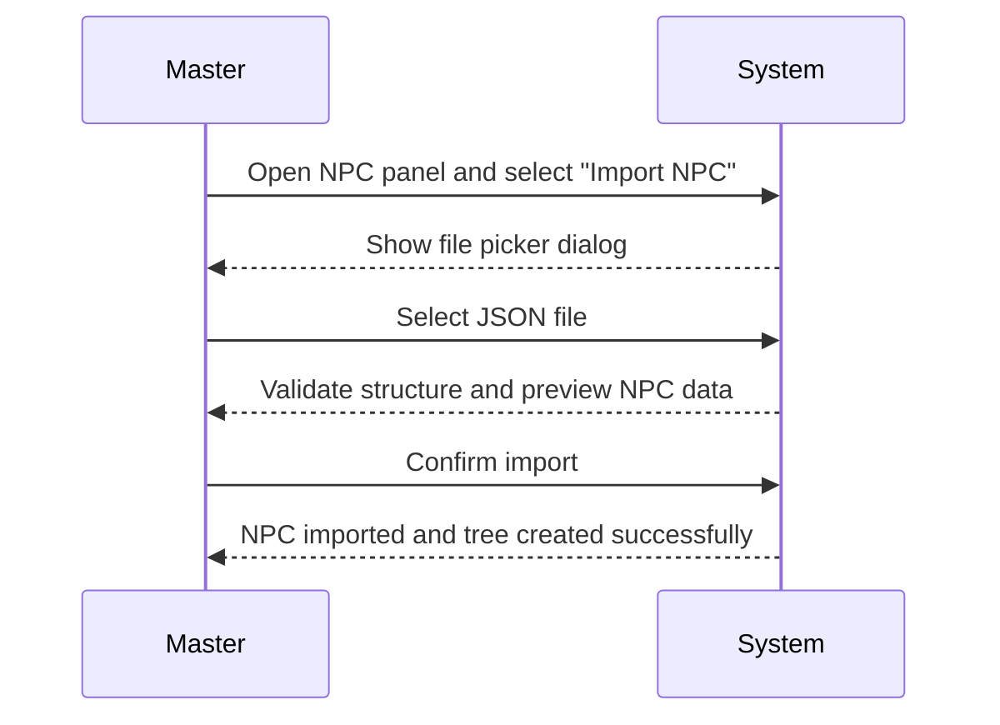
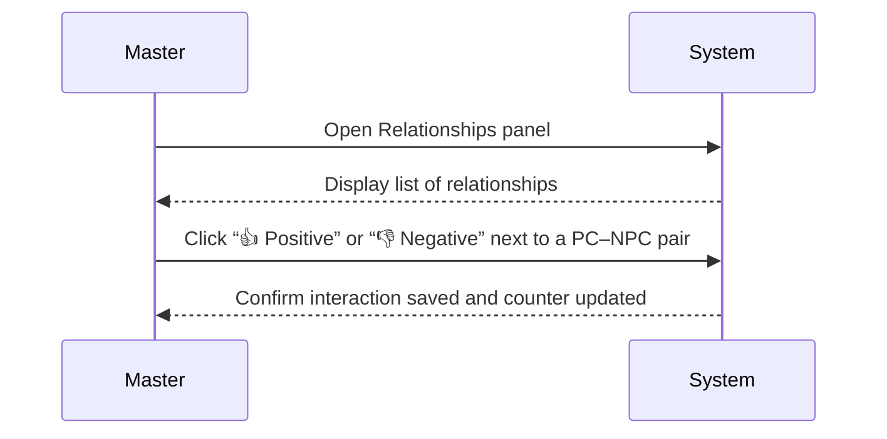
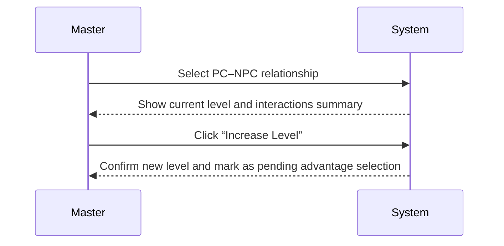
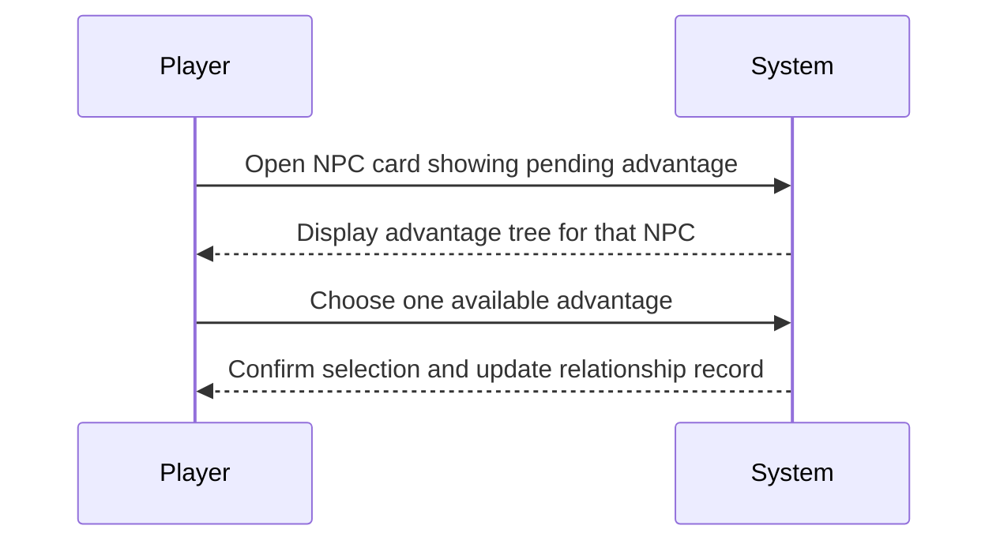
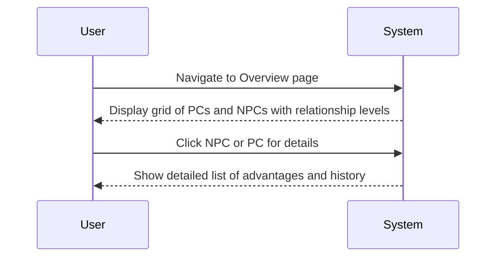
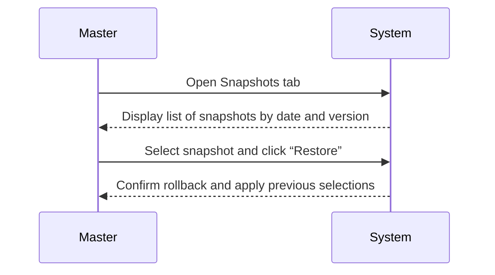

# Documento de Flujos de Uso (v1.0)
### Sistema de Relaciones — Campaña *El Regente de Jade*
**Versión:** 1.0  
**Autor:** Alberto Cebrián  
**Fecha:** Octubre de 2025  

---

## Índice
1. Import NPC  
2. Register Interaction  
3. Increase Relationship Level  
4. Select Advantage  
5. Review Relationships and Advantages  
6. Restore Snapshot  

---

## 1. Import NPC

**Description:**  
Allows the Master to import NPC data and its advantage tree from a JSON file. Automatically generates advantage IDs if missing.

| Actor | Action | System response | Outcome |
|--------|---------|------------------|----------|
| Master | Select “Import NPC” | Opens file selection dialog | Ready to choose file |
| Master | Upload JSON file | Validates schema | File loaded |
| Master | Confirm import | Creates NPC and advantages | NPC stored in DB |
| System | Save data | Confirms completion | NPC visible in NPC list |

**Validations and errors:**
- Invalid JSON → Display error message.
- Missing NPC name → Reject import.
- Duplicate NPC ID → Prevent overwrite unless confirmed.
- Invalid advantage links → Show warning and skip invalid branches.

---

## 2. Register Interaction

**Description:**  
Allows the Master to record a positive or negative interaction between a Player Character (PC) and an NPC, affecting relationship counters.

| Actor | Action | System response | Outcome |
|--------|---------|------------------|----------|
| Master | Open Relationships panel | Shows all PC–NPC relationships | Master views overview |
| Master | Press “👍” or “👎” | Registers new interaction | Interaction logged |
| System | Update counter | Displays updated relationship count | Visual feedback shown |

**Validations and errors:**
- If the relationship doesn’t exist → Show “No active relationship” error.
- If the DB connection fails → Show retry message.
- If multiple interactions happen too fast → Queue updates safely.

---

## 3. Increase Relationship Level

**Description:**  
Allows the Master to manually increase a relationship level when appropriate, marking the relationship as pending a new advantage selection.

| Actor | Action | System response | Outcome |
|--------|---------|------------------|----------|
| Master | Open relationship detail | Displays current stats | Context ready |
| Master | Increase level | Updates value and pending flag | Level +1 |
| System | Save change | Confirms with visual alert | Awaiting advantage selection |

**Validations and errors:**
- Max level reached → Show “Maximum relationship level achieved.”
- Relationship inconsistent → Auto-reset invalid advantages and warn Master.

---

## 4. Select Advantage

**Description:**  
Allows a Player to select an advantage for a specific NPC when their relationship level has increased.

| Actor | Action | System response | Outcome |
|--------|---------|------------------|----------|
| Player | Open NPC view | Shows current level and pending flag | Ready for choice |
| Player | Select advantage | Validates prerequisites | Choice accepted |
| System | Save selection | Updates DB and removes pending flag | Advantage acquired |

**Validations and errors:**
- Missing prerequisites → Show “Cannot select this advantage.”
- Advantage already chosen → Disable button.
- Connection failure → Retry and notify.

---

## 5. Review Relationships and Advantages

**Description:**  
Allows both Master and Players to review all relationships, current levels, and selected advantages in a summarized view.

| Actor | Action | System response | Outcome |
|--------|---------|------------------|----------|
| User | Open Overview page | Loads relationship data | Summary visible |
| User | Click entity | Expands detailed view | Data detailed |
| System | Load advantages | Displays all selected and available ones | Full visibility |

**Validations and errors:**
- Data missing → Show “No relationship data found.”
- NPC image unavailable → Show placeholder.
- Slow load → Display progress indicator.

---

## 6. Restore Snapshot

**Description:**  
Allows the Master to restore a previous state of advantages for a given relationship using a snapshot.

| Actor | Action | System response | Outcome |
|--------|---------|------------------|----------|
| Master | Open Snapshots tab | Lists snapshots with timestamps | History visible |
| Master | Choose snapshot | Previews content | Ready to confirm |
| Master | Confirm restore | Applies stored data | Rollback complete |

**Validations and errors:**
- Snapshot missing or corrupt → Show “Invalid snapshot file.”
- NPC or advantage no longer exists → Keep denormalized reference and warn user.
- Attempting to restore same state → Show “Already at this version.”

---

**Version 1.0 — Complete Use Flow Document**  
Includes functional user–system interactions, sequence diagrams, step-by-step procedures, and error handling lists for all six primary workflows.

