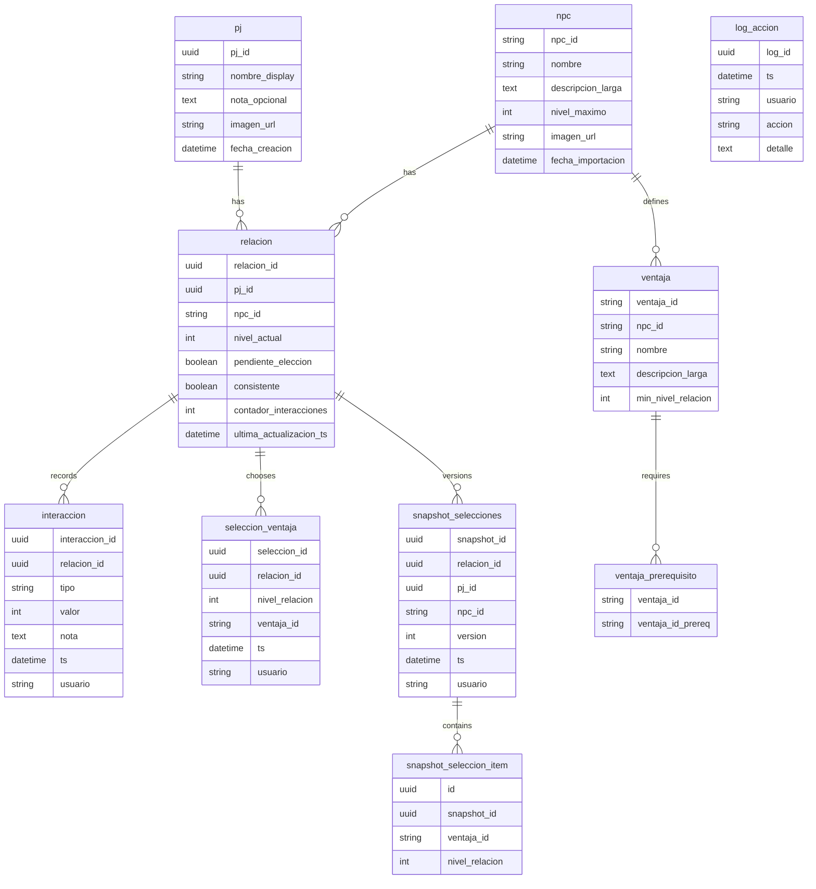

# Documento de Modelo de Datos Físico
### Sistema de Relaciones — Campaña *El Regente de Jade*
**Versión:** 1.0  
**Autor:** Alberto Cebrián  
**Fecha:** Octubre de 2025  

---

## 1. Objetivo y alcance
Este documento define el **modelo físico de datos** de la aplicación, detallando **tablas**, **columnas**, **tipos**, **claves** y **restricciones** en **H2**. Incluye todas las tablas **principales y auxiliares**, así como el **diagrama ER** en Mermaid.

Convenciones y consideraciones principales:
- **Nomenclatura:** `snake_case` para tablas y columnas.
- **Tipos H2:** `UUID`, `VARCHAR`, `INT`, `BOOLEAN`, `TIMESTAMP`, `TEXT`.
- **Texto largo:** usar `TEXT` para descripciones extensas; en H2 se mapea a CLOB, adecuado para el caso.
- **URLs de imagen:** `VARCHAR(255)` con rutas locales relativas.
- **Retención de snapshots:** los **snapshots no se borran automáticamente** en operaciones habituales (sirven para revertir estados). Se permite **eliminar o archivar** snapshots de forma explícita por decisión del máster.

---

## 2. Tablas y columnas

### 2.1 `pj`
- `pj_id` — `UUID` **PK**
- `nombre_display` — `VARCHAR(100)` **UNIQUE, NOT NULL**
- `nota_opcional` — `TEXT` **NULL**
- `imagen_url` — `VARCHAR(255)` **NULL**
- `fecha_creacion` — `TIMESTAMP` **NOT NULL**

**Índices adicionales:** ninguno necesario.

---

### 2.2 `npc`
- `npc_id` — `VARCHAR(64)` **PK** (coincide con identificador de catálogo)
- `nombre` — `VARCHAR(120)` **UNIQUE, NOT NULL**
- `descripcion_larga` — `TEXT` **NULL**
- `nivel_maximo` — `INT` **NOT NULL**
- `imagen_url` — `VARCHAR(255)` **NULL**
- `fecha_importacion` — `TIMESTAMP` **NULL**

**Índices adicionales:** ninguno necesario.

---

### 2.3 `ventaja`
- `ventaja_id` — `VARCHAR(160)` **PK**  
  > Autogenerado si falta en importación: `npc_id` + `_` + `nombre_normalizado`.
- `npc_id` — `VARCHAR(64)` **FK** → `npc.npc_id` **ON DELETE CASCADE**
- `nombre` — `VARCHAR(150)` **NOT NULL**
- `descripcion_larga` — `TEXT` **NULL**
- `min_nivel_relacion` — `INT` **NOT NULL**

**Índices adicionales:** `IDX_ventaja_npc` en (`npc_id`).

---

### 2.4 `ventaja_prerequisito`
- `ventaja_id` — `VARCHAR(160)` **FK** → `ventaja.ventaja_id` **ON DELETE CASCADE**
- `ventaja_id_prereq` — `VARCHAR(160)` **FK** → `ventaja.ventaja_id` **ON DELETE RESTRICT**

**PK compuesta:** (`ventaja_id`, `ventaja_id_prereq`).

---

### 2.5 `relacion`
- `relacion_id` — `UUID` **PK**
- `pj_id` — `UUID` **FK** → `pj.pj_id` **ON DELETE CASCADE**
- `npc_id` — `VARCHAR(64)` **FK** → `npc.npc_id` **ON DELETE CASCADE**
- `nivel_actual` — `INT` **NOT NULL**
- `pendiente_eleccion` — `BOOLEAN` **NOT NULL**
- `consistente` — `BOOLEAN` **NOT NULL**
- `contador_interacciones` — `INT` **NOT NULL**
- `ultima_actualizacion_ts` — `TIMESTAMP` **NOT NULL**

**Restricciones:** `UNIQUE (pj_id, npc_id)`  
**Índices adicionales:** `IDX_relacion_pj` en (`pj_id`), `IDX_relacion_npc` en (`npc_id`).

---

### 2.6 `interaccion`
- `interaccion_id` — `UUID` **PK**
- `relacion_id` — `UUID` **FK** → `relacion.relacion_id` **ON DELETE CASCADE**
- `tipo` — `VARCHAR(16)` **NOT NULL**  
  Valores previstos: `POSITIVA`, `NEGATIVA`.
- `valor` — `INT` **NOT NULL**  
  Por defecto ±1; preparado para otros enteros.
- `nota` — `TEXT` **NULL**
- `ts` — `TIMESTAMP` **NOT NULL**
- `usuario` — `VARCHAR(64)` **NOT NULL`

**Índices adicionales:** `IDX_interaccion_rel_ts` en (`relacion_id`, `ts DESC`).

---

### 2.7 `seleccion_ventaja`
- `seleccion_id` — `UUID` **PK**
- `relacion_id` — `UUID` **FK** → `relacion.relacion_id` **ON DELETE CASCADE**
- `nivel_relacion` — `INT` **NOT NULL**
- `ventaja_id` — `VARCHAR(160)` **FK** → `ventaja.ventaja_id` **ON DELETE RESTRICT**
- `ts` — `TIMESTAMP` **NOT NULL`
- `usuario` — `VARCHAR(64)` **NOT NULL`

**Restricciones:** `UNIQUE (relacion_id, nivel_relacion)`.

---

### 2.8 `snapshot_selecciones`
> Instantánea completa de las ventajas elegidas en una relación.

- `snapshot_id` — `UUID` **PK**
- `relacion_id` — `UUID` **FK NULLABLE** → `relacion.relacion_id` **ON DELETE SET NULL**
- `pj_id` — `UUID` **NULL**  
  > Copia denormalizada para retención si se elimina la relación.
- `npc_id` — `VARCHAR(64)` **NULL**  
  > Copia denormalizada para retención si se elimina la relación.
- `version` — `INT` **NOT NULL**
- `ts` — `TIMESTAMP` **NOT NULL**
- `usuario` — `VARCHAR(64)` **NOT NULL`

**Restricciones:** `UNIQUE (relacion_id, version)` con `relacion_id` no nulo.  
> Cuando `relacion_id` sea `NULL` por eliminación, la unicidad por relación deja de aplicar y la versión se conserva como dato histórico.

---

### 2.9 `snapshot_seleccion_item`
- `id` — `UUID` **PK**
- `snapshot_id` — `UUID` **FK** → `snapshot_selecciones.snapshot_id` **ON DELETE CASCADE**
- `ventaja_id` — `VARCHAR(160)` **FK** → `ventaja.ventaja_id` **ON DELETE SET NULL**
- `nivel_relacion` — `INT` **NOT NULL**

**Índices adicionales:** `IDX_snapshot_item_snapshot` en (`snapshot_id`).

---

### 2.10 `log_accion`
- `log_id` — `UUID` **PK**
- `ts` — `TIMESTAMP` **NOT NULL**
- `usuario` — `VARCHAR(64)` **NOT NULL**
- `accion` — `VARCHAR(64)` **NOT NULL**
- `detalle` — `TEXT` **NULL**

**Índices adicionales:** `IDX_log_ts` en (`ts`).

---

## 3. Relaciones y reglas de borrado

- **`npc` → `ventaja`**: **ON DELETE CASCADE**. Al eliminar un NPC se eliminan sus ventajas.
- **`npc` → `relacion`**: **ON DELETE CASCADE**. Al eliminar un NPC, se eliminan relaciones, y en cascada sus **interacciones** y **selecciones**.
- **`relacion` → `interaccion`**: **ON DELETE CASCADE**.
- **`relacion` → `seleccion_ventaja`**: **ON DELETE CASCADE**.
- **`ventaja` → `ventaja_prerequisito`**: **ON DELETE CASCADE** para la ventaja principal; **RESTRICT** para la ventaja requerida.
- **`snapshot_selecciones`**: **no se borran automáticamente** cuando cambia el árbol o las selecciones.  
  - Si se elimina la **relación**, `snapshot_selecciones.relacion_id` se marca `NULL` y se **conservan** los snapshots con `pj_id` y `npc_id` denormalizados.  
  - Si se elimina el **NPC**, los snapshots se **mantienen** como histórico, con `npc_id` denormalizado (aunque ya no exista en `npc`).

> Esta política permite **recuperar estados previos** incluso tras operaciones de limpieza, preservando la trazabilidad histórica. 

---

## 4. Índices y restricciones de unicidad

Aunque la base es pequeña, se definen índices puntuales para consultas frecuentes y ordenaciones:

- `relacion`: `IDX_relacion_pj` en (`pj_id`), `IDX_relacion_npc` en (`npc_id`).
- `interaccion`: `IDX_interaccion_rel_ts` en (`relacion_id`, `ts DESC`).
- `snapshot_item`: `IDX_snapshot_item_snapshot` en (`snapshot_id`).
- `log_accion`: `IDX_log_ts` en (`ts`).

**Unicidad:**
- `pj.nombre_display` **UNIQUE**.
- `npc.nombre` **UNIQUE**.
- `relacion (pj_id, npc_id)` **UNIQUE**.
- `seleccion_ventaja (relacion_id, nivel_relacion)` **UNIQUE**.
- `snapshot_selecciones (relacion_id, version)` **UNIQUE** cuando `relacion_id` no es `NULL`.

---

## 5. Diagrama ER físico en Mermaid

> Nota Mermaid: se han evitado paréntesis y anotaciones tipo PK FK dentro de los bloques para asegurar un render correcto.

---

## 6. Directorios físicos y rutas de imágenes

- **Directorio base de datos:** `./data/database.mv.db`
- **Imágenes PJ:** `./data/images/pj/`  
  **URL relativa:** `images/pj/nombre_archivo.jpg`
- **Imágenes NPC:** `./data/images/npc/`  
  **URL relativa:** `images/npc/nombre_archivo.jpg`
- **Catálogos JSON:** `./data/catalogos/`

La aplicación servirá los ficheros estáticos desde el propio backend o un servidor de archivos local. En ambos casos, las rutas guardadas en BD deben ser **relativas** al raíz estático para facilitar portabilidad.

---

## 7. Notas de implementación

- La generación de `ventaja_id` se realiza en la **capa de importación**, normalizando `nombre` y concatenando con `npc_id`.  
- La tabla `snapshot_selecciones` incluye `pj_id` y `npc_id` **denormalizados** para conservar contexto si se elimina la relación.  
- Las **cascadas** se definen para simplificar limpieza cuando se elimina un NPC o una relación, **sin afectar** a la retención histórica de snapshots.

---

**Versión 1.0 — Documento de Modelo de Datos Físico completo.**  
Incluye tablas, claves, índices, reglas de borrado y diagrama ER válido en Mermaid. 

